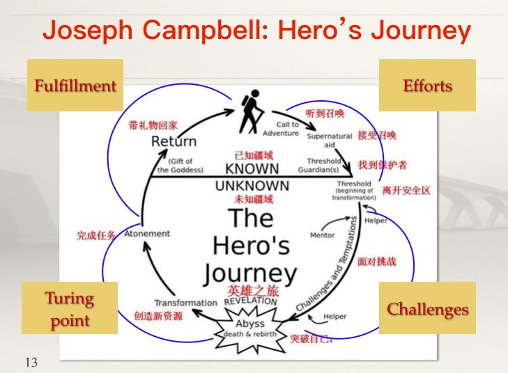

《千面英雄》 1948年出版

#### 英雄的成长

遵循着同样的模式，需要经历三个部分：

启程、启蒙、回归

12阶段


一、启程

它包括了5个阶段，分别是：

使命的召唤、拒绝召唤、超自然的援助、跨越第一个阈限。

二、启蒙

启蒙是英雄之旅的重头戏，坎贝尔把这部分分解为6个阶段：

分别是考验之路、遇到女神、妖妇的诱惑、与天父重归于好、奉若神明和最终的恩赐。


三、归来

英雄之旅的第三个部分，叫做归来。

这个部分包括6个阶段，分别是：

拒绝回归、借助魔法逃脱、来自外界的解救、跨越归来的阈限、两个世界的主宰以及生活的自由。

```
英雄的终点不是宝藏、恩赐或美人，而是为了归来，
为了把一切冒险所得回馈给他的人民。
当我们历经沧桑之后也应该像英雄一样，
学会如何控制自己、克服人性的弱点，成就自己也成就自己的人民，从而获得真正的自由。

```



